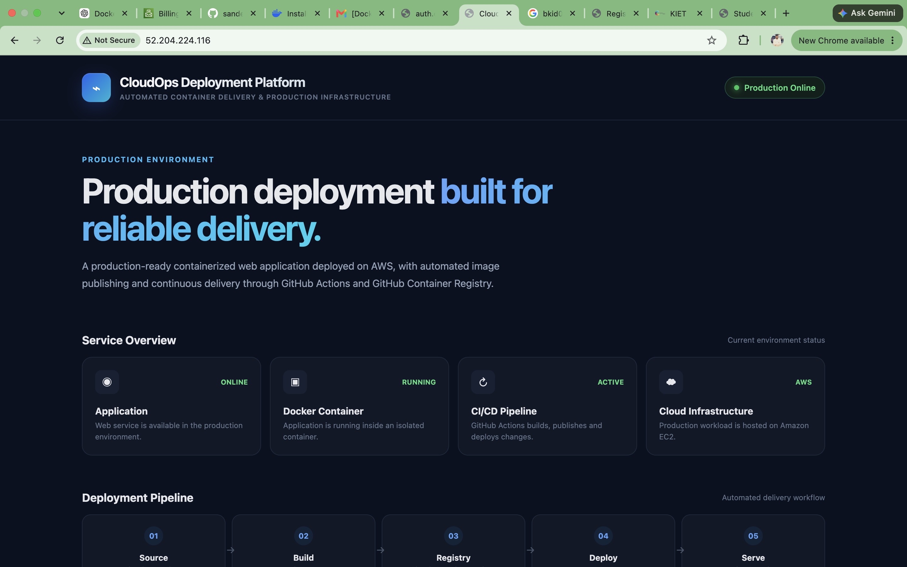
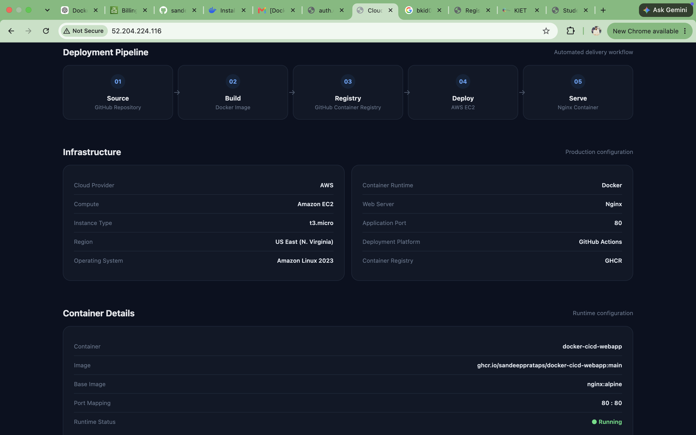
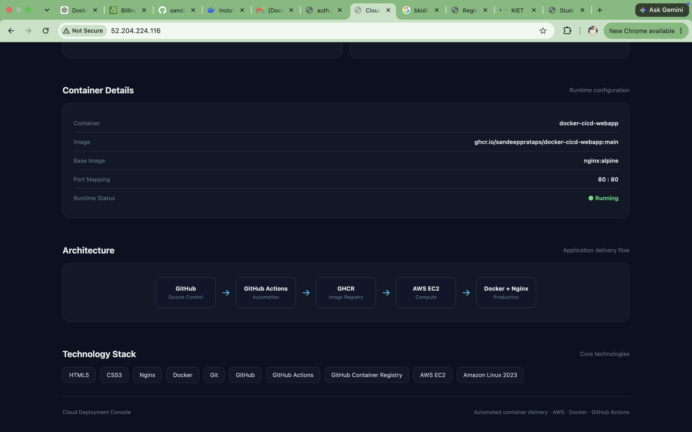
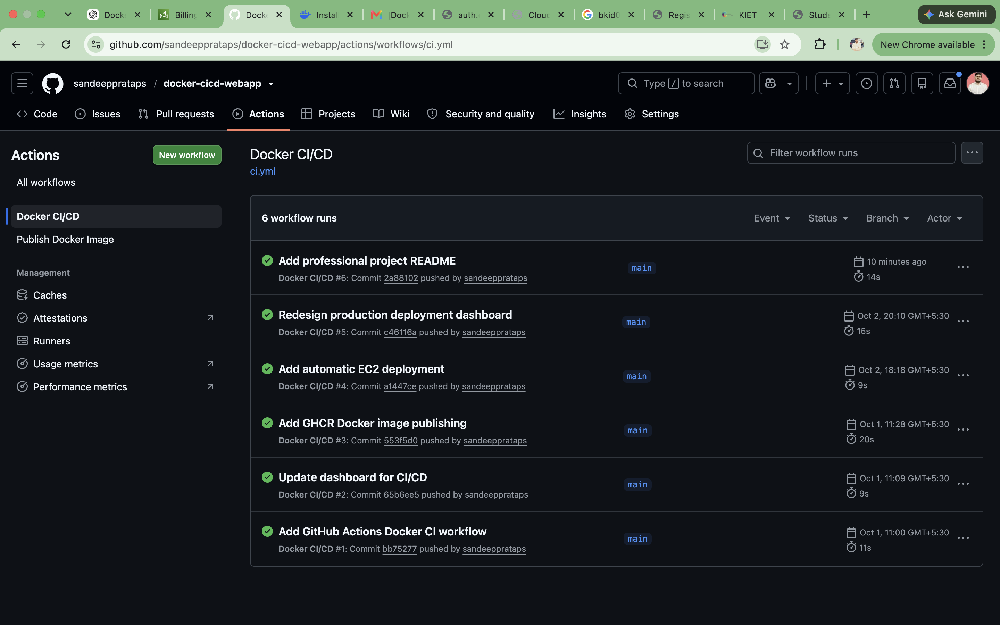
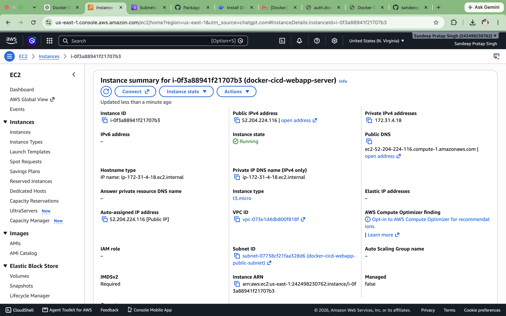

# CloudOps Deployment Platform

> Automated Container Delivery & Production Infrastructure using Docker, GitHub Actions, GitHub Container Registry, and AWS EC2.

## Overview

CloudOps Deployment Platform is a containerized web application with an automated CI/CD pipeline.

The project demonstrates how a web application can be packaged as a Docker container, published to GitHub Container Registry, and automatically deployed to an AWS EC2 server whenever changes are pushed to the `main` branch.

## Architecture

Developer
    │
    ▼
GitHub Repository
    │
    ▼
GitHub Actions
    │
    ├── Build Docker Image
    │
    ├── Publish Image
    │
    ▼
GitHub Container Registry (GHCR)
    │
    ▼
AWS EC2
    │
    ├── Docker
    │
    └── Nginx Container
    │
    ▼
Production Web Application

Technology Stack

Frontend: HTML5, CSS3
Web Server: Nginx
Containerization: Docker
CI/CD: GitHub Actions
Container Registry: GitHub Container Registry (GHCR)
Cloud Platform: AWS
Compute: Amazon EC2
Operating System: Amazon Linux 2023
Version Control: Git & GitHub
CI/CD Pipeline

The deployment pipeline follows these steps:

Developer pushes changes to the main branch.
GitHub Actions automatically starts the workflow.
The application is checked out from the repository.
Docker builds the application image.
The Docker image is published to GitHub Container Registry.
GitHub Actions connects to the AWS EC2 server.
The latest container image is pulled from GHCR.
The previous container is replaced with the new version.
The updated application becomes available through the EC2 server.
Docker

The application uses Nginx as the web server.

FROM nginx:alpine

LABEL org.opencontainers.image.source="https://github.com/sandeepprataps/docker-cicd-webapp"

COPY index.html /usr/share/nginx/html/index.html

EXPOSE 80
GitHub Container Registry

Docker images are published to:

ghcr.io/sandeepprataps/docker-cicd-webapp

The image is automatically updated through the GitHub Actions workflow.

AWS EC2 Deployment

The application is deployed on an Amazon EC2 instance running Amazon Linux 2023.

Docker runs the production container and maps:

EC2 Port 80 → Container Port 80

The deployment is automated through GitHub Actions.

Local Setup

Clone the repository:

git clone https://github.com/sandeepprataps/docker-cicd-webapp.git
cd docker-cicd-webapp

Build the Docker image:

docker build -t docker-cicd-webapp .

Run the container:

docker run -d \
  --name docker-cicd-webapp-container \
  -p 8080:80 \
  docker-cicd-webapp

Open the application:
http://localhost:8080

## Project Screenshots

### Production Dashboard

### Deployment Pipeline & Infrastructure

### Architecture & Technology Stack

### Docker CI/CD Pipeline

### AWS EC2 Infrastructure

Project Structure
docker-cicd-webapp/
│
├── .github/
│   └── workflows/
│       ├── ci.yml
│       └── publish.yml
│
├── .gitignore
├── Dockerfile
├── index.html
└── README.md
Key Features
Containerized web application
Production-style dashboard UI
Docker-based deployment
Automated Docker image builds
GitHub Container Registry integration
Automated AWS EC2 deployment
Continuous delivery using GitHub Actions
Nginx-based production container
Responsive dashboard interface
Security

Sensitive credentials are not stored in the repository.

AWS SSH credentials and deployment configuration are managed through GitHub Actions Secrets.

Future Improvements
HTTPS with a custom domain
AWS Application Load Balancer
Infrastructure as Code using Terraform
Monitoring and logging
Automated rollback
Blue-green deployment
AWS CloudWatch integration
Author

Sandeep Pratap Singh

GitHub:
https://github.com/sandeepprataps